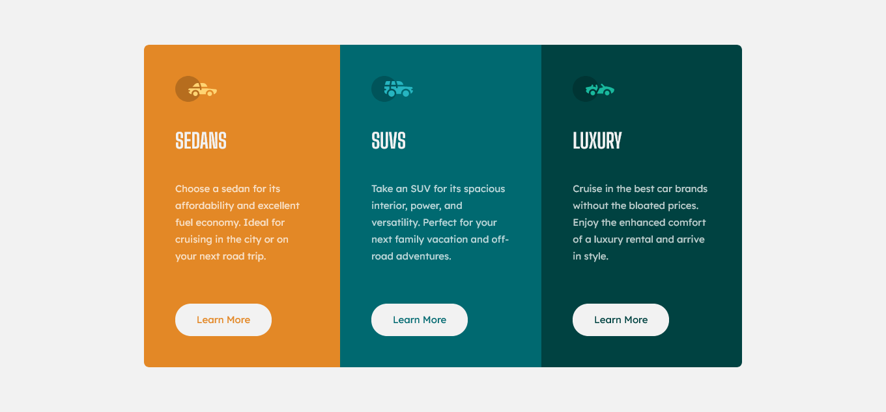

# Frontend Mentor - 3-column preview card component solution

This is a solution to the [3-column preview card component challenge on Frontend Mentor](https://www.frontendmentor.io/challenges/3column-preview-card-component-pH92eAR2-). Frontend Mentor challenges help you improve your coding skills by building realistic projects.

## Table of contents

-   [Overview](#overview)
    -   [The challenge](#the-challenge)
    -   [Screenshot](#screenshot)
    -   [Links](#links)
-   [My process](#my-process)
    -   [Built with](#built-with)
    -   [What I learned](#what-i-learned)
-   [Author](#author)

## Overview

### The challenge

Users should be able to:

-   View the optimal layout depending on their device's screen size
-   See hover states for interactive elements

### Screenshot



### Links

-   Solution URL: [github.com/yusuf-s1/3-column-preview-card-component](https://github.com/yusuf-s1/3-column-preview-card-component)
-   Live Site URL: [Visit Live Site]([https://your-live-site-url.com](https://yusuf-s1.github.io/3-column-preview-card-component/))

## My process

### Built with


-   HTML5
-   CSS
-   Flexbox
-   CSS Grid (to center main)
-   Mobile-first workflow

### What I learned

I learned that line-height property is really efficient and like this projects that have multiple and exact layout we should keep less code with same class name.

```html
<h1>Some HTML code I'm proud of</h1>
```

```css
.para {
    line-height: 1.75;
}
.btn {
    .....;
}
.btn1 {
    .....;
}
.btn2 {
    .....;
}
.btn3 {
    .....;
}
```

## Author

-   Website - [Add your name here](https://yusufs.w3spaces.com/)
-   Frontend Mentor - [@yourusername](https://www.frontendmentor.io/profile/yusfsqrtof)
